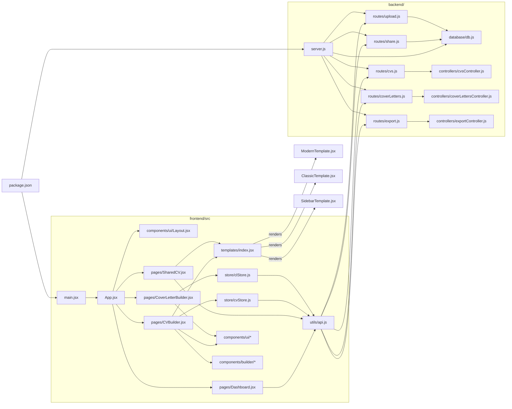

# Project Graph

## Summary

The repo is split into a React/Vite frontend and an Express/SQLite backend. The frontend routes through `App.jsx`, uses Zustand stores for CV and cover letter editing, and calls the API layer in `frontend/src/utils/api.js`. The backend mounts route modules in `server.js`, with controllers handling CV CRUD, cover letters, exports, sharing, and uploads.
